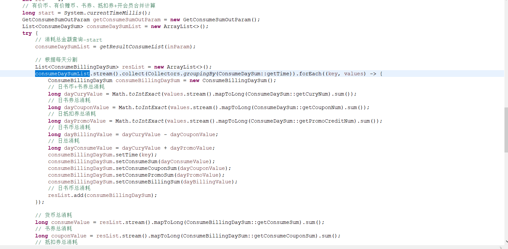

数据库：  
mysql -h 11.180.156.8 -P3306 -uyw_bill_token -p'8HoMq$nz@y' -D yw_paylog  --default-character-set=utf8 -c  
表：  
yw_charge_day_sum   |
| yw_consume_day_sum

服务：  PayLogV3Server  
接口：  
getConsumeDaySum  
getChargeDaySum  
queryChargeSum  
queryConsumeSum  

消费日志计算方式：  
// 日书币总消耗  
long dayBillingValue = dayCuryValue - dayCouponValue；  
// 日总消耗  
long dayConsumeValue = dayCuryValue + dayPromovalue；

